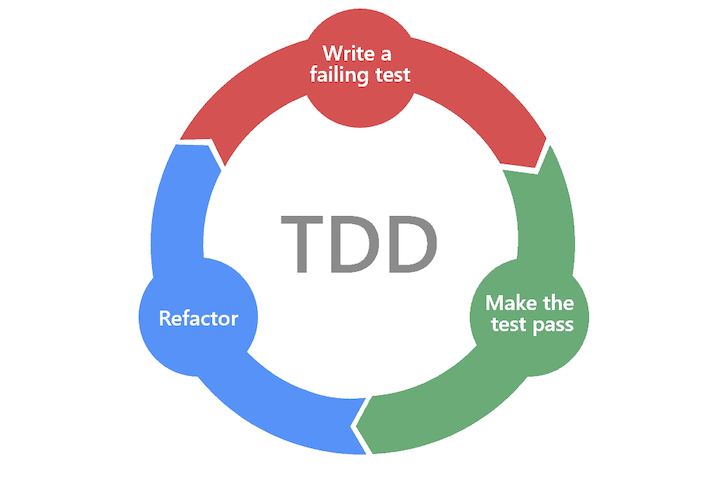

# Test Driven Development (TDD)
---
## What is TDD?

TDD refers to a style of programming in which three activities are tightly interwoven: coding, testing (in the form of writing unit tests) and design (in the form of refactoring).

It can be succinctly described by the following set of rules:

- write a “single” unit test describing an aspect of the program
- run the test, which should fail because the program lacks that feature
- write “just enough” code, the simplest possible, to make the test pass
- “refactor” the code until it conforms to the simplicity criteria
- repeat, “accumulating” unit tests over time

*https://www.agilealliance.org/glossary/tdd/*

## Red Green Refactor!

### Red
Introduce a test for desired functionality that fails (or does not compile)

### Green
Modify code to make new and existing tests pass, committing whatever sins necessary in the process to accomplish quickly

### Refactor
Take time to make the code good

